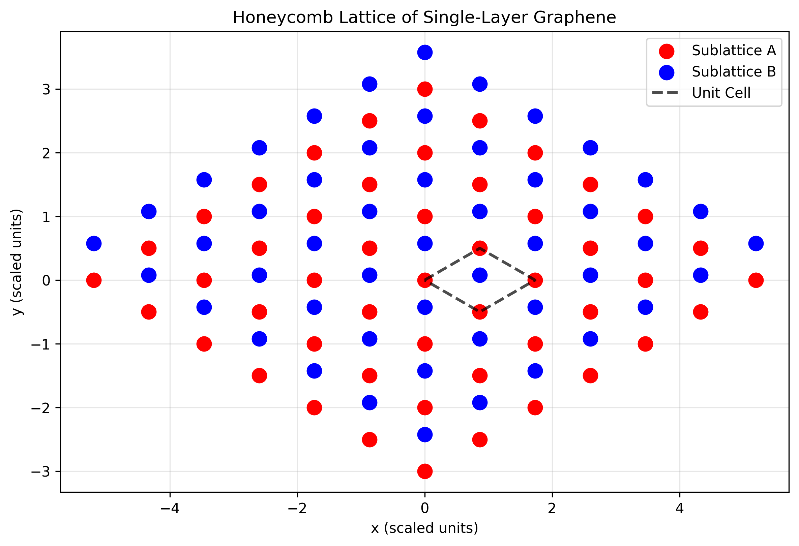
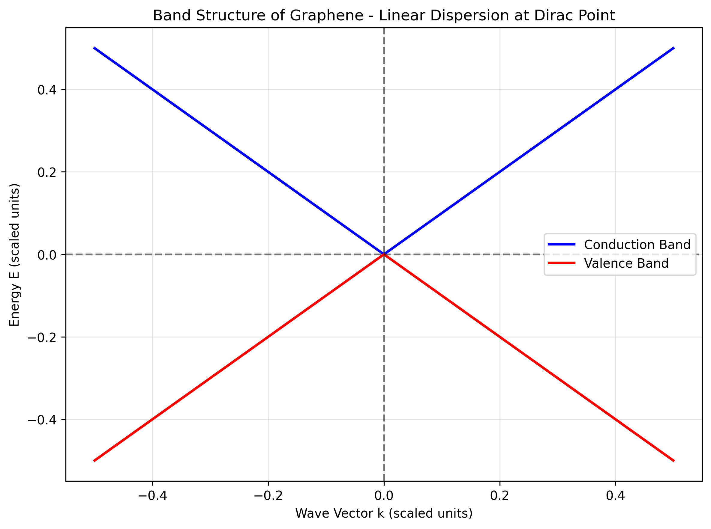
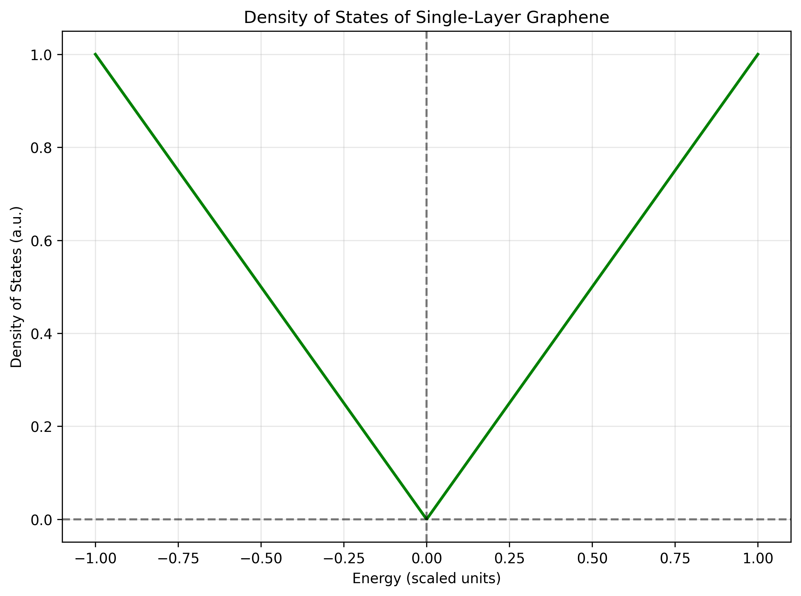
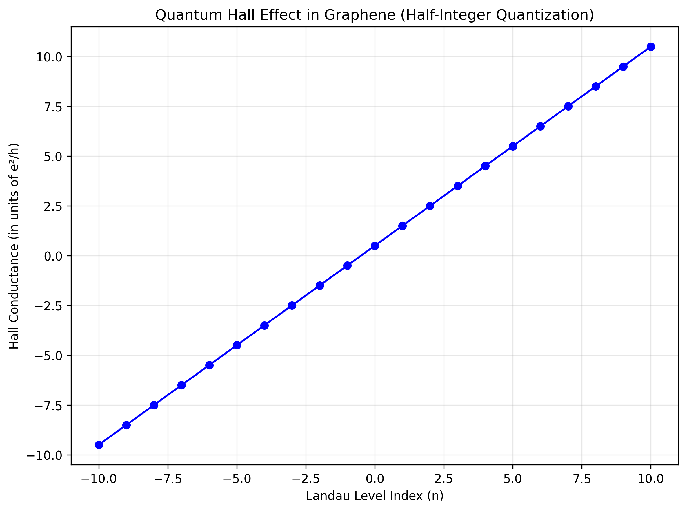
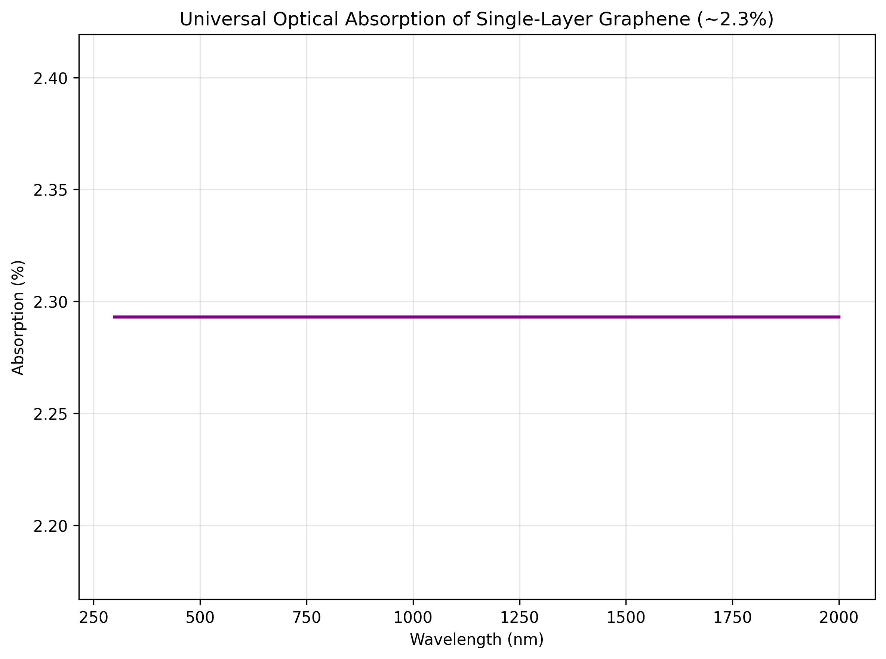

# Single-Layer Graphene: Fundamental Properties and Calculations

This repository contains computational studies of the fundamental electronic and transport properties of single-layer graphene, demonstrating key concepts in condensed matter physics and nanotechnology.

## Table of Contents
- [Introduction](#introduction)
- [Electronic Band Structure](#electronic-band-structure)
- [Transport Properties](#transport-properties)
- [Optical Properties](#optical-properties)
- [Installation](#installation)
- [Usage](#usage)
- [Key Results](#key-results)

## Introduction

Single-layer graphene is a two-dimensional material consisting of carbon atoms arranged in a honeycomb lattice. It exhibits remarkable electronic properties due to its unique band structure, where electrons behave as massless Dirac fermions near the K-points of the Brillouin zone.

Key features of graphene:
- Zero bandgap semiconductor
- Linear dispersion relation near Dirac points
- Unique quantum Hall effect (half-integer quantization)
- Universal optical absorption (~2.3%)
- Exceptional carrier mobility

## Electronic Band Structure

### Honeycomb Lattice Structure


Graphene's crystal structure consists of two interpenetrating triangular sublattices (A and B), forming a hexagonal Bravais lattice. Each carbon atom is sp² hybridized and forms σ-bonds with three neighboring carbon atoms. This unique structure gives rise to graphene's remarkable electronic properties.

### Band Structure


The electronic band structure of graphene shows two bands (valence and conduction) that touch at discrete points called Dirac points, located at the K and K' points of the Brillouin zone. Near these points, the energy dispersion relation is linear:

E(k) = ±v_F |k|

where v_F ≈ 10⁶ m/s is the Fermi velocity. This linear dispersion makes electrons behave as massless Dirac fermions.

### Density of States


Unlike conventional 2D materials, graphene has a density of states that vanishes linearly at the Dirac point, resulting in unique transport and thermodynamic properties. At the charge neutrality point (Dirac point), the density of states is zero.

## Transport Properties

### Quantum Hall Effect


Graphene exhibits an anomalous quantum Hall effect with half-integer quantization:

σ_Hall = ±4(e²/h)(n + 1/2)

where n = 0, 1, 2, ..., and the factor of 4 comes from spin and valley degeneracy. This half-integer quantization is a direct consequence of the Berry phase of π for charge carriers in graphene.

## Optical Properties

### Universal Optical Absorption


Graphene exhibits universal optical absorption of approximately 2.3% (πα, where α is the fine-structure constant) across a wide range of frequencies, from visible to infrared. This is due to its unique electronic band structure with linear dispersion. This value is independent of wavelength and arises from the interband transitions at the Dirac points.

The optical conductivity of graphene is approximately:

σ₀ = πe²/(2ħ) ≈ 4π/α⁻¹ ≈ 6.5 × 10⁻⁵ S

## Installation

1. Clone the repository:
```bash
git clone https://github.com/prometheus5863/single-layer-graphene.git
cd single-layer-graphene
```

2. Install required dependencies:
```bash
pip install numpy matplotlib scipy
```

## Usage

To reproduce the calculations and generate the plots:

```bash
python generate_plots.py
```

This script will generate all the plots shown in this README.

## Key Results

1. **Zero Band Gap**: Graphene is a zero-gap semiconductor with linear dispersion at the Dirac points
2. **Massless Electrons**: Charge carriers behave as massless Dirac fermions with linear energy-momentum relation
3. **Half-Integer Quantum Hall Effect**: Unique quantization due to Berry phase of π
4. **Vanishing Density of States**: At the Dirac point, the density of states goes to zero linearly
5. **Universal Optical Absorption**: πα ≈ 2.3% absorption per layer independent of frequency
6. **Honeycomb Lattice**: Unique two-sublattice structure giving rise to special electronic properties

## Mathematical Foundations

### Tight-Binding Model
The electronic properties of graphene can be understood using the tight-binding model, considering only nearest-neighbor π-orbital overlaps:

H = -t Σ ⟨i,j⟩ (a†_i b_j + h.c.)

where t ≈ 2.8 eV is the hopping parameter, and a†_i, b_j are creation/annihilation operators for sublattices A and B.

### Low-Energy Effective Hamiltonian
Near the K-points, the Hamiltonian becomes:

H = v_F (k_x σ_x + k_y σ_y)

where σ are Pauli matrices and v_F is the Fermi velocity, showing the massless Dirac fermion nature.

## References

1. Novoselov, K. S. et al. "Electric field effect in atomically thin carbon films." Science 306, 666-669 (2004).
2. Zhang, Y. et al. "Experimental observation of the quantum Hall effect and Berry's phase in graphene." Nature 438, 201-204 (2005).
3. Castro Neto, A. H. et al. "The electronic properties of graphene." Reviews of Modern Physics 81, 109-162 (2009).
4. Wallace, P. R. "The band theory of graphite." Physical Review 71, 622 (1947).

## Author

Harsh Vardhan - PhD Student, IIT BHU Physics Department

This repository demonstrates foundational understanding of graphene physics with computational examples and visualizations that highlight the unique electronic properties arising from its honeycomb lattice structure.